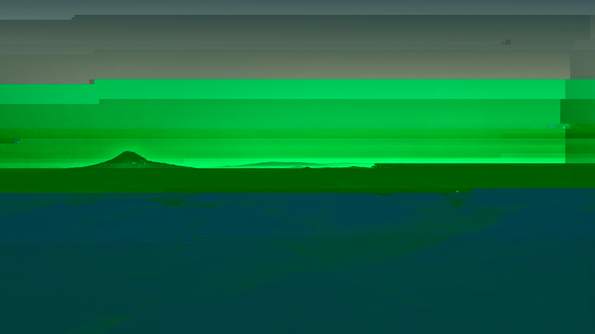
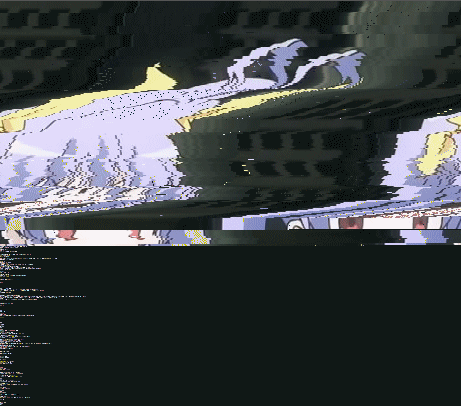
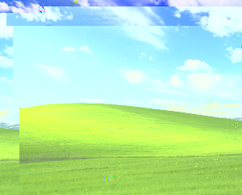

```
convert -coalesce fun.gif fun_frame%d.jpg
for f in fun_frame*.jpg; do convert $f -gravity center -pointsize 150 -annotate 0 'gltch' $f; gltch $f; done
convert fun_frame*.jpg -layers Optimize fun.gif
```


small utility to 'glitch' files, most notably .jpg files, originally made to replace the slow image glitch part of [glitchlock](https://github.com/xero/glitchlock). all this really does is write data to random places within the file, skipping headers to attempt to not completely ruin the file. I've found it quite useful for testing invalid or corrupted input for other programs and glitching various files. used also in [my small lockscreen script](https://github.com/Ckath/dotfiles-n-stuff/blob/master/scripts/lockscreen.sh)

## demo
some files glitched using gltch
   

## install
`make install`

## usage
```
usage: gltch [-d data] [-n passes] [-s skip/offset] file
-d	data to write to random positions, ^A by default
-n	number of passes, 10 by default
-s	headerbytes to skip, 20 by default
```

